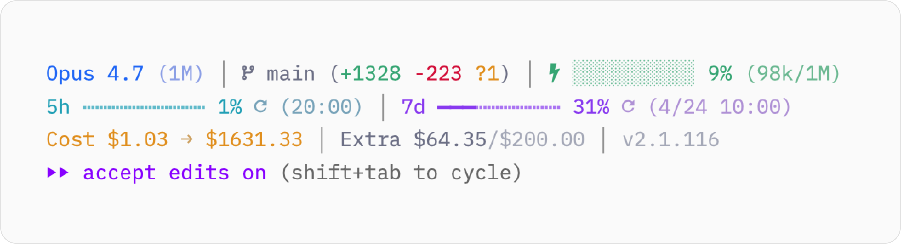
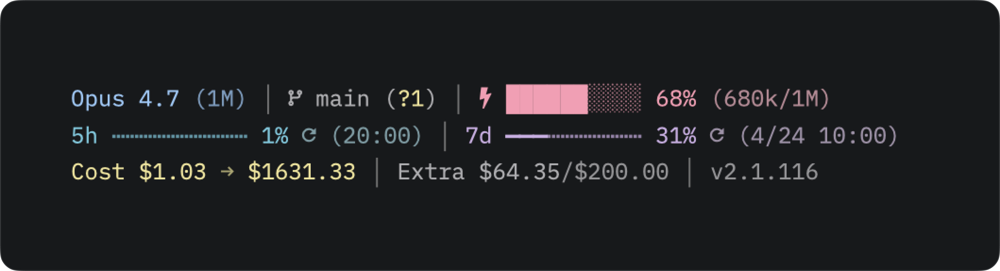

# cc-pretty-statusline

A pretty, theme-aware status line for [Claude Code](https://claude.com/claude-code) CLI.

Pastel palette tuned for both dark and light terminals, automatic theme
detection, session cost tracking, usage bars, and honest respect for
`CLAUDE_CONFIG_DIR` so multi-account setups don't cross-contaminate.

<p align="center">
  
  &nbsp;&nbsp;
  
</p>

## Features

- Adaptive light/dark palette that follows macOS system appearance, or
  pin it at install time with `--theme light|dark`.
- Model, context bar, branch + diff, session duration, 5h/7d rate
  limits, today / total cost, Extra usage, Claude Code version.
- Multi-account safe — scoped by `CLAUDE_CONFIG_DIR`.

## Fonts

Needs a Nerd Font (or Nerd Font fallback) — otherwise icons render as
`□`. Recommended: [Lilex](https://github.com/mishamyrt/Lilex) or
JetBrains Mono Nerd Font from
[nerd-fonts](https://github.com/ryanoasis/nerd-fonts/releases).

## Install

Requires `jq`, `curl`, and `git` on `$PATH`. Optional:
[`ccusage`](https://github.com/ryoppippi/ccusage) (`npm i -g ccusage`)
for the cost / usage line — without it that line is hidden.

```bash
npx cc-pretty-statusline
```

Or clone and run:

```bash
git clone https://github.com/minoism/cc-pretty-statusline
cd cc-pretty-statusline
node bin/install.js
```

The installer prompts for a palette — pick `auto` to follow your
terminal's theme, or pin `light` / `dark`. For non-interactive installs,
pass the mode directly:

```bash
npx cc-pretty-statusline --theme auto    # detect per render
npx cc-pretty-statusline --theme light   # pin light
npx cc-pretty-statusline --theme dark    # pin dark
```

`auto` writes a plain `bash "~/.claude/statusline.sh"` entry; pinned
modes prepend `CLAUDE_STATUSLINE_THEME=<mode>` to the command. Re-run
the installer any time to change the choice.

It copies `statusline.sh` into your `CLAUDE_CONFIG_DIR` (default
`~/.claude`) and writes the `statusLine` entry into your
`settings.json`. Existing files are backed up to `statusline.sh.bak`.

Restart Claude Code to see the new status line.

## Uninstall

```bash
node bin/install.js --uninstall
```

Restores the previous statusline if a backup exists; otherwise removes
the file and the `settings.json` entry.

## Multiple accounts

The installer honors `CLAUDE_CONFIG_DIR`, so each Claude Code profile
gets its own copy of `statusline.sh` and its own `settings.json` entry.
Export the variable and run the installer once per profile:

```bash
CLAUDE_CONFIG_DIR=/path/to/other-profile npx cc-pretty-statusline --theme auto
```

Cache files and keychain lookups in `statusline.sh` are already scoped
per `CLAUDE_CONFIG_DIR`, so profiles stay isolated at runtime too.

## Terminals that don't follow macOS appearance

Auto mode reads macOS system appearance, so any terminal that follows
the system (Zed's `theme.mode: "system"`, Terminal.app default, iTerm's
auto-switch, etc.) just works. For terminals locked to a fixed theme
(iTerm with a pinned profile, WezTerm, Alacritty, Zed with a hard-coded
`theme.mode`), two escape hatches:

**Bind a theme-toggle.** Run this alongside your terminal's own
light/dark toggle:

```bash
~/.claude/statusline.sh --set-theme light   # or dark, or auto to re-detect
```

**Pre-launch probe.** Add this to your shell rc to capture the
terminal's real background before Claude starts:

```bash
eval "$(~/.claude/statusline.sh --probe-bg)"
```

Only captures the initial state — for mid-session toggles use
`--set-theme`.

## Credits

Forked and substantially rewritten from
[kamranahmedse/claude-statusline](https://github.com/kamranahmedse/claude-statusline).

## License

MIT — see [LICENSE](LICENSE).
